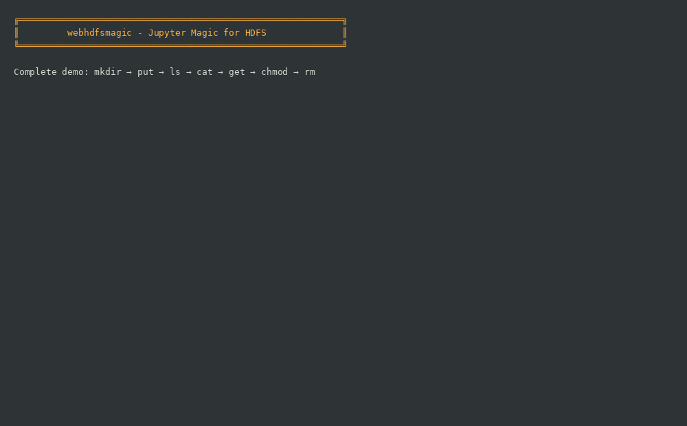

# webhdfsmagic

**webhdfsmagic** is a Python package that provides IPython magic commands to interact with HDFS via WebHDFS/Knox Gateway directly from your Jupyter notebooks.

## 🚀 Why webhdfsmagic?

Simplify your HDFS interactions in Jupyter:

**Before** (with PyWebHdfsClient):
```python
from pywebhdfs.webhdfs import PyWebHdfsClient
hdfs = PyWebHdfsClient(host='...', port='...', user_name='...', ...)
data = hdfs.read_file('/data/file.csv')
df = pd.read_csv(BytesIO(data))
```

**Now** (with webhdfsmagic):
```python
%hdfs get /data/file.csv .
df = pd.read_csv('file.csv')
```

**93% less code!** ✨

## 🎬 See it in Action



*Complete workflow demo: mkdir → put → ls → cat → get → chmod → rm*

## ✨ Features

| Command | Description |
|----------|-------------|
| `%hdfs ls [path]` | List files and directories (returns pandas DataFrame) |
| `%hdfs mkdir <path>` | Create directory (parents created automatically) |
| `%hdfs put <local> <hdfs>` | Upload one or more files (supports wildcards `*.csv`, <br><span style="color:#0969da;font-weight:500">-t, --threads &lt;N&gt;</span> for parallel uploads) |
| `%hdfs get <hdfs> <local>` | Download files (supports wildcards and `~` for home directory, <br><span style="color:#0969da;font-weight:500">-t, --threads &lt;N&gt;</span> for parallel downloads) |
| `%hdfs cat <file> [-n lines] [--format type] [--raw]` | Display file content with smart formatting for CSV/Parquet |
| `%hdfs rm [-r] <path>` | Delete files/directories (`-r` for recursive, supports wildcards) |
| `%hdfs chmod [-R] <mode> <path>` | Change permissions (`-R` for recursive) |
| `%hdfs chown [-R] <user:group> <path>` | Change owner (`-R` for recursive, requires superuser) |

## 📦 Installation

```bash
pip install webhdfsmagic
```

**Install from source:**
```bash
git clone https://github.com/ab2dridi/webhdfsmagic.git
cd webhdfsmagic
pip install -e .

# Enable autoload (creates startup script)
jupyter-webhdfsmagic
```

## 🔧 Configuration

### Automatic Loading

After installation, **enable autoload** to have webhdfsmagic load automatically in all Jupyter sessions:

```bash
jupyter-webhdfsmagic
```

This creates `~/.ipython/profile_default/startup/00-webhdfsmagic.py` so the extension loads automatically.

**Alternative:** Load manually in each notebook:
```python
%load_ext webhdfsmagic
```

### Configuration File

Create `~/.webhdfsmagic/config.json`:

```json
{
  "knox_url": "https://hostname:port/gateway/default",
  "webhdfs_api": "/webhdfs/v1",
  "username": "your_username",
  "password": "your_password",
  "verify_ssl": false
}
```

**SSL Options:**
- `"verify_ssl": false` → Disable SSL verification (development only)
- `"verify_ssl": true` → Use system certificates
- `"verify_ssl": "/path/to/cert.pem"` → Use custom certificate (supports `~`)

**Configuration Examples:**  
See [examples/config/](examples/config/) for complete configurations (with/without SSL, custom certificate, etc.)

**Sparkmagic Fallback:**  
If `~/.webhdfsmagic/config.json` doesn't exist, the package tries `~/.sparkmagic/config.json` and extracts configuration from `kernel_python_credentials.url`.

### Logging & Debugging

All operations are automatically logged to `~/.webhdfsmagic/logs/webhdfsmagic.log` for debugging and auditing purposes.

**Log Features:**
- ✅ Automatic rotation (10MB per file, keeps 5 backups)
- ✅ Detailed HTTP request/response logging
- ✅ Operation tracing with timestamps
- ✅ Error tracking with full stack traces
- ✅ Password masking for security
- ✅ File-level DEBUG logging
- ✅ Console-level WARNING/ERROR logging

**View Recent Logs:**
```bash
# View last 50 lines
tail -50 ~/.webhdfsmagic/logs/webhdfsmagic.log

# Follow logs in real-time
tail -f ~/.webhdfsmagic/logs/webhdfsmagic.log

# Search for errors
grep "ERROR" ~/.webhdfsmagic/logs/webhdfsmagic.log

# View specific operation
grep "hdfs put" ~/.webhdfsmagic/logs/webhdfsmagic.log
```

**Log Format:**
```
2025-12-08 10:30:15 - webhdfsmagic - INFO - [magics.py:145] - >>> Starting operation: hdfs ls
2025-12-08 10:30:15 - webhdfsmagic - DEBUG - [client.py:85] - HTTP Request: GET http://...
2025-12-08 10:30:15 - webhdfsmagic - DEBUG - [client.py:105] - HTTP Response: 200 from http://...
2025-12-08 10:30:15 - webhdfsmagic - INFO - [magics.py:180] - <<< Operation completed: hdfs ls - SUCCESS
```

## 💡 Usage

```python
# The extension is already loaded automatically!
%hdfs help

# List files
%hdfs ls /data

# Create a directory
%hdfs mkdir /user/hdfs/output

# Upload multiple CSV files using wildcards
%hdfs put ~/data/*.csv /user/hdfs/input/

# Download a file to home directory
%hdfs get /user/hdfs/results/output.csv ~/downloads/

# Download multiple files with wildcards
%hdfs get /user/hdfs/results/*.csv ./local_results/

# ===== SMART CAT (File Preview) =====

# Display first 50 lines (default grid table format)
%hdfs cat /user/hdfs/data/file.csv -n 50

# Smart CSV formatting with automatic table display
%hdfs cat /user/hdfs/data/sales.csv

# Display Parquet file as table
%hdfs cat /user/hdfs/data/records.parquet -n 20

# Pandas format (classic DataFrame representation)
%hdfs cat /user/hdfs/data/data.csv --format pandas

# Polars format (shows schema + explicit types, 3.7x faster for Parquet!)
%hdfs cat /user/hdfs/data/records.parquet --format polars

# Raw text display (unformatted original content)
%hdfs cat /user/hdfs/data/file.csv --raw

# ===== File Management =====

# Delete files with wildcards
%hdfs rm /user/hdfs/temp/*.log

# Delete a directory recursively
%hdfs rm -r /user/hdfs/temp

# Change permissions recursively
%hdfs chmod -R 755 /user/hdfs/data

# Change owner recursively (requires superuser privileges)
%hdfs chown -R hdfs:hadoop /user/hdfs/data
```

**Integration with pandas:**
```python
# Download and read directly
%hdfs get /data/sales.csv .
df = pd.read_csv('sales.csv')
df.head()
```

## 🎯 Advanced Features

### Wildcard Operations

Upload, download, and delete multiple files using shell-style wildcards:

```python
# Upload all CSV files
%hdfs put data/*.csv /hdfs/input/

# Download specific pattern
%hdfs get /hdfs/output/result_*.csv ./downloads/

# Delete log files
%hdfs rm /hdfs/temp/*.log
```

### Smart File Formatting (CSV & Parquet)

Automatically format structured files as readable tables:

```python
# CSV files are automatically detected and formatted
%hdfs cat /data/sales.csv
# ┌────────────┬─────────┬────────┐
# │ date       │ product │ amount │
# ├────────────┼─────────┼────────┤
# │ 2025-12-08 │ laptop  │ 1200   │
# │ 2025-12-09 │ phone   │ 800    │
# └────────────┴─────────┴────────┘

# Parquet files work seamlessly
%hdfs cat /data/records.parquet -n 100

# TSV and other delimiters are auto-detected
%hdfs cat /data/data.tsv  # Detects tab delimiter

# Force specific format
%hdfs cat /data/file.csv --format pandas  # Pandas DataFrame (classic)
%hdfs cat /data/file.csv --format polars  # Polars with schema and types
%hdfs cat /data/file.csv --raw            # Raw text, no formatting

# Supported formats:
#   - CSV (comma, tab, semicolon, pipe - auto-detected)
#   - Parquet (uses Polars for 3.7x faster processing)
#   - TSV (tab-separated values)
```

**📊 Format Options Explained**:
- **Default (grid)**: Beautiful ASCII table, perfect for reports
- **`--format pandas`**: Classic pandas display, familiar to data scientists
- **`--format polars`**: Shows schema with explicit types (str, i64, f64, bool) - ideal for data validation
- **`--raw`**: Original file content without any parsing

**🚀 Performance**: Parquet files are processed using **Polars**, providing ultra-fast reads and minimal memory usage (3.7x faster than PyArrow+Pandas).

**Memory Protection**: By default, the `cat` command limits downloads to **50 MB** to prevent memory saturation. This protection applies when using `-n <lines>` option. To read entire large files, use `-n -1`:

```python
# Safe: Limited to 50 MB download
%hdfs cat /huge_file.csv -n 100

# Full read: No memory limit (use with caution on large files)
%hdfs cat /small_file.csv -n -1
```

**⚠️ Large Parquet Files**: Files > 100 MB will show a warning recommending to download first with `%hdfs get` for better performance.

### Parallel Uploads & Downloads (Multi-threaded PUT/GET)

Starting from version 0.0.4, webhdfsmagic supports **parallel file transfers** using the `--threads` (or `-t`) option for both `put` and `get` commands.

This allows you to upload or download multiple files simultaneously, greatly speeding up operations on large datasets or many files.

**Key features:**
- Multi-threaded transfers for PUT and GET
- Syntax: `%hdfs put --threads N <local_files> <hdfs_dir>`
- Syntax: `%hdfs get --threads N <hdfs_files> <local_dir>`
- N = number of threads (e.g. 4, 8, 16)

**Examples:**
```python
# Parallel upload: PUT multiple files to HDFS using 4 threads
%hdfs put --threads 4 *.csv /demo/data/

# Parallel download: GET multiple files from HDFS using 4 threads
%hdfs get --threads 4 /demo/data/* ./downloads/

# You can also use the short option -t
%hdfs put -t 8 *.tsv /demo/data/
```

- The `--threads`/`-t` option is available for both `put` and `get` commands.
- You can specify any number of threads (e.g. 2, 4, 8, 16) depending on your system and network.
- Parallel transfers are especially useful for large datasets or many small files.
- Error handling is robust: if a file fails to transfer, you’ll get a clear error message for that file.
- The command syntax is identical to single-threaded, just add `--threads N` or `-t N`.

See the [notebook demo](examples/demo_real_cluster.ipynb) for a full example.


## 📖 Built-in Help System

Get detailed help directly in your notebook:

```python
# Show all available commands with descriptions
%hdfs help
```

This displays a **comprehensive interactive help** with:
- All available commands (ls, mkdir, put, get, cat, rm, chmod, chown)
- Options and flags for each command
- Format descriptions for the `cat` command
- Auto-detection features explanation

**Summary of available commands:**

| Command | Description |
|---------|-------------|
| `%hdfs help` | Display this help |
| `%hdfs setconfig {...}` | Set configuration (JSON format) |
| `%hdfs ls [path]` | List files and directories |
| `%hdfs mkdir <path>` | Create directory |
| `%hdfs rm <path> [-r]` | Delete file/directory <br> <span style="color:#0969da;font-weight:500">-r</span> : recursive deletion |
| `%hdfs put <local> <hdfs>` | Upload files (supports wildcards) <br> <span style="color:#0969da;font-weight:500">-t, --threads &lt;N&gt;</span> : use N parallel threads for multi-file uploads |
| `%hdfs get <hdfs> <local>` | Download files (supports wildcards) <br> <span style="color:#0969da;font-weight:500">-t, --threads &lt;N&gt;</span> : use N parallel threads for multi-file downloads |
| `%hdfs cat <file> [options]` | Smart file preview (CSV/TSV/Parquet) <br> <span style="color:#0969da;font-weight:500">-n &lt;lines&gt;</span> : limit to N rows (default: 100) <br> <span style="color:#0969da;font-weight:500">--format &lt;type&gt;</span> : force format (csv, parquet, pandas, polars, raw) <br> <span style="color:#0969da;font-weight:500">--raw</span> : display raw content without formatting |
| `%hdfs chmod [-R] <mode> <path>` | Change permissions (e.g., 644, 755) <br> <span style="color:#0969da;font-weight:500">-R</span> : recursive |
| `%hdfs chown [-R] <user:group> <path>` | Change owner and group <br> <span style="color:#0969da;font-weight:500">-R</span> : recursive |

**Examples:**

- `%hdfs cat data.csv -n 10` – Preview first 10 rows
- `%hdfs cat data.parquet --format pandas` – Display in pandas format (classic)
- `%hdfs cat data.parquet --format polars` – Display with schema and types
- `%hdfs put *.csv /data/` – Upload all CSV files
- `%hdfs put -t 4 ./data/*.csv /hdfs/input/` – Upload files with 4 parallel threads
- `%hdfs get -t 8 /hdfs/output/*.parquet ./results/` – Download files with 8 parallel threads
- `%hdfs chmod -R 755 /mydir` – Set permissions recursively

The help command is always available and shows the most up-to-date documentation for your installed version.

### Recursive Permissions

Apply permission changes to entire directory trees:

```python
# Recursive chmod
%hdfs chmod -R 755 /hdfs/project/

# Recursive chown (requires superuser)
%hdfs chown -R hdfs:hadoop /hdfs/project/
```

### Home Directory Expansion

Use `~` as a shortcut for your home directory:

```python
# Download to home directory
%hdfs get /hdfs/file.csv ~/downloads/

# Works in subdirectories too
%hdfs get /hdfs/data/*.csv ~/projects/analysis/
```

## 📚 Documentation and Examples

- **[examples/demo.ipynb](examples/demo.ipynb)** - Full demo with real HDFS cluster (Docker)
- **[examples/examples.ipynb](examples/examples.ipynb)** - Examples with mocked tests (no cluster needed)
- **[examples/config/](examples/config/)** - Configuration file examples
- **[ROADMAP.md](ROADMAP.md)** - Upcoming features

## 🧪 Testing

**Unit tests** (no HDFS cluster required):
```bash
pytest tests/ -v
```

**Test with Docker HDFS cluster:**
```bash
# Start the demo environment
cd demo
docker-compose up -d

# Wait 30 seconds for initialization
sleep 30

# Configure webhdfsmagic (if not already done)
mkdir -p ~/.webhdfsmagic
cat > ~/.webhdfsmagic/config.json << 'EOF'
{
  "knox_url": "http://localhost:8080/gateway/default",
  "webhdfs_api": "/webhdfs/v1",
  "username": "testuser",
  "password": "testpass",
  "verify_ssl": false
}
EOF

# Test with demo notebook
cd ..
jupyter notebook examples/demo.ipynb
```

See [demo/README.md](demo/README.md) for complete Docker environment documentation.

## 🐛 Troubleshooting

### Check Logs

All operations are logged to `~/.webhdfsmagic/logs/webhdfsmagic.log`:

```bash
# View recent activity
tail -50 ~/.webhdfsmagic/logs/webhdfsmagic.log

# Check for errors
grep -i "error" ~/.webhdfsmagic/logs/webhdfsmagic.log

# View specific command execution
grep "hdfs put" ~/.webhdfsmagic/logs/webhdfsmagic.log -A 5
```

### Common Issues

**Connection Errors:**
- Check Knox gateway URL in `~/.webhdfsmagic/config.json`
- Verify SSL settings (`verify_ssl: false` for testing)
- Check logs for HTTP error details

**Authentication Errors:**
- Verify username/password in config
- Check if credentials have expired
- Review authentication errors in logs

**File Transfer Issues:**
- Check local file paths exist
- Verify HDFS paths are absolute (start with `/`)
- Review detailed HTTP request/response in logs
- Check disk space on both local and HDFS

**Permission Errors:**
- Verify HDFS user permissions
- Check file/directory ownership in HDFS
- Review operation logs for specific error messages

## 🤝 Contributing

Contributions are welcome! To contribute:

1. Fork the project
2. Create a branch (`git checkout -b feature/my-feature`)
3. Commit your changes (`git commit -m 'feat: add new feature'`)
4. Push to the branch (`git push origin feature/my-feature`)
5. Open a Pull Request

**Testing and code quality:**
```bash
# Run tests
pytest tests/ -v

# Check code style
ruff check .
ruff format .
```

## 📝 License

This project is licensed under the MIT License. See [LICENSE](LICENSE) for details.

## 🔗 Links

- **PyPI:** https://pypi.org/project/webhdfsmagic/
- **GitHub:** https://github.com/ab2dridi/webhdfsmagic
- **Issues:** https://github.com/ab2dridi/webhdfsmagic/issues

## 📬 Contact

For questions or suggestions, open an issue on GitHub.

